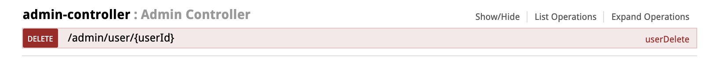
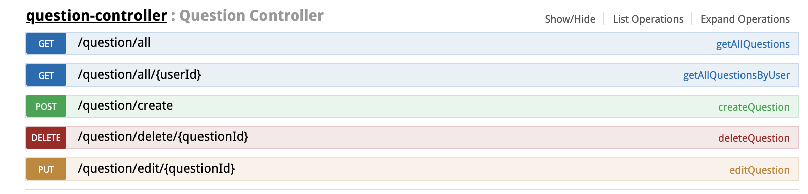
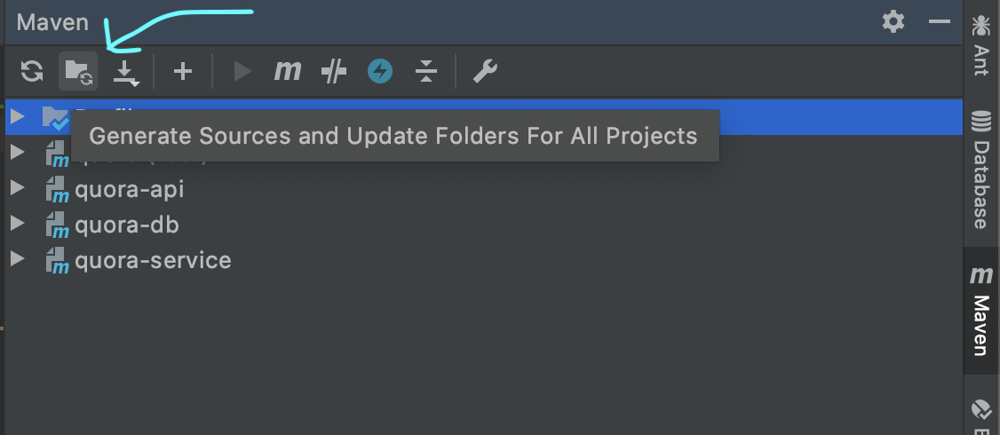
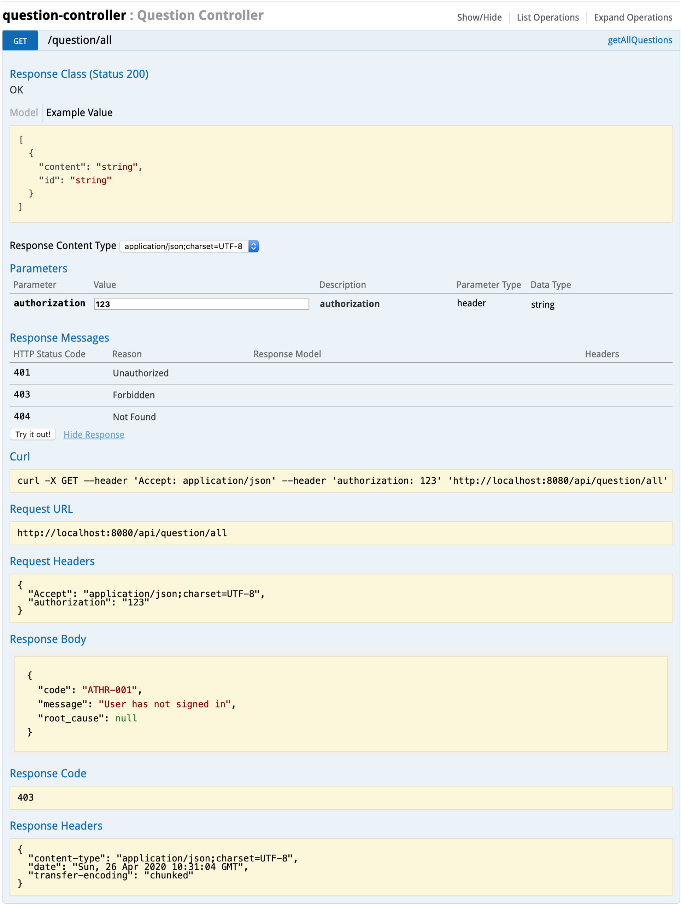
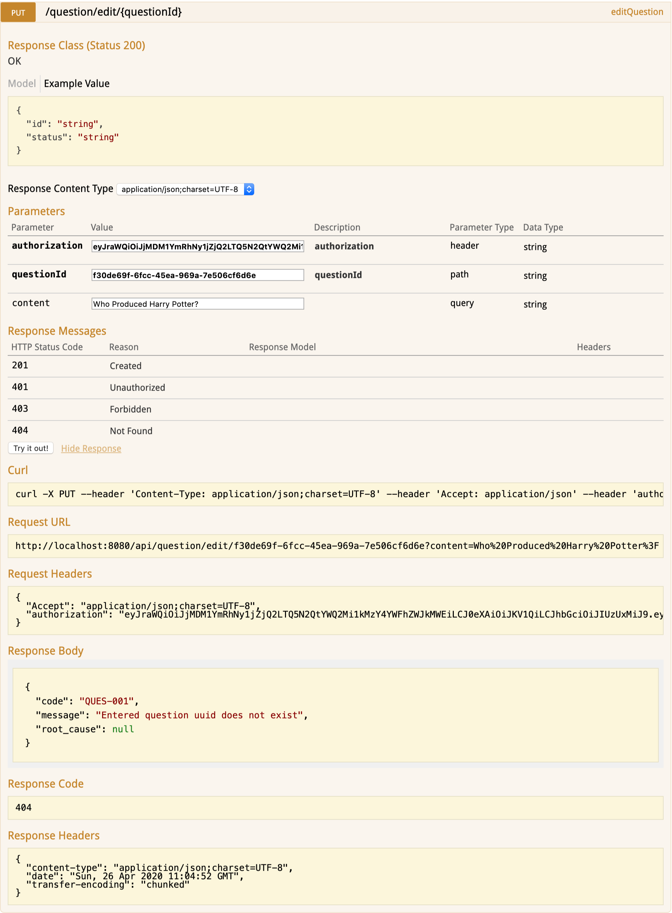
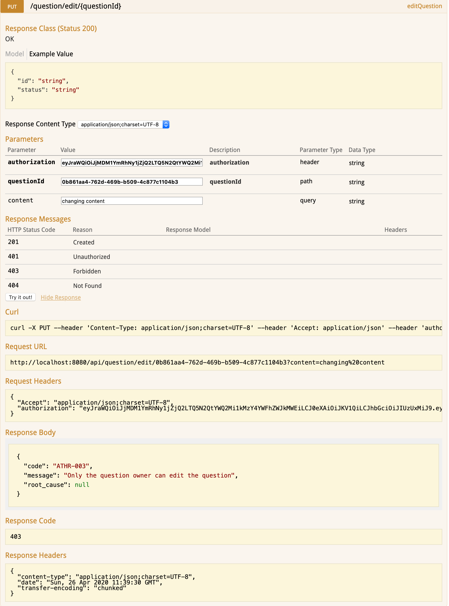
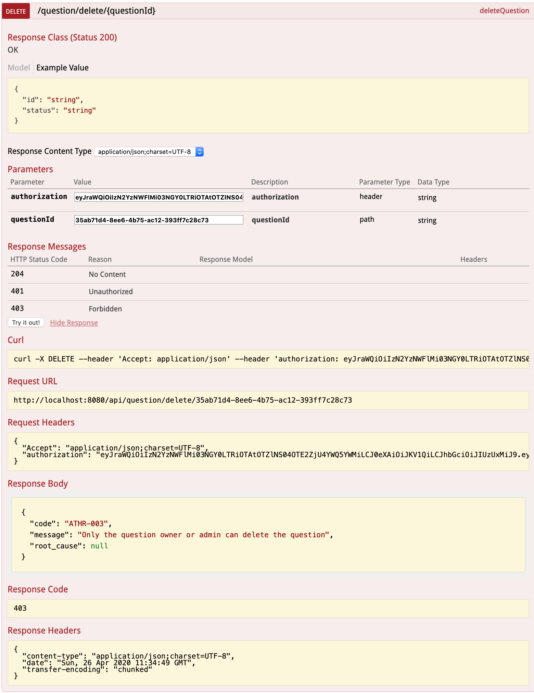
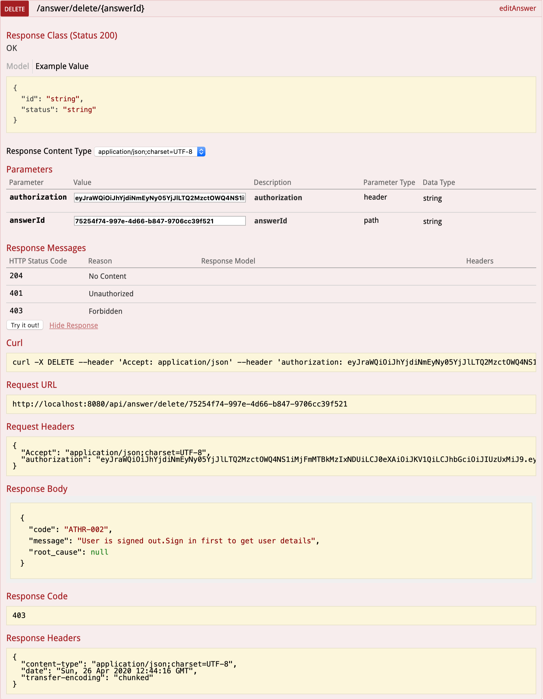

# About Project

To incorporate REST API endpoints with various functionalities required for a website (similar to Quora).

---

## Course:

Course 5 Group Project

---

## Project Name: 

Social Q&A web-app

---

## Git Repository

https://github.com/cs5grproj/cs1.git

---

## Team Members

- Prabhavathi Dodda | doddaprabha@gmail.com
- Sindhuja Sabbani | sindhuja.sabbani@gmail.com
- Sowmya Jhetty | jsowmya@outlook.com
- Anil Kumar Narayanan | anilnarayanan@hotmail.com

---

## REST API Endpoints

### Endpoint 1

- **User Controller**                         
    
                                  
    

    

### Endpoint 2

- **QuestionController**
    

	
### Endpoint 3

- **AnswerController**
    

---

### Project import instructions (Intellij IDEA)

1. Import Project from Version Control
    

2. Provide GIT repository path to clone the project to the local target directory
    

3. Import Maven dependencies
    

    

---

### Project build instructions

1. Open terminal available in the Intellij IDE

2. Change to the project directory i.e Trello_quora

3. Execute the below Maven commands on the terminal:

    `mvn clean install -PskipTests`
    
    `mvn clean install -Psetup`

---

### Swagger UI

```http://localhost:8080/api/swagger-ui.html```

---

### Manual Testing Results on Swagger UI

- #### Endpoint 1
    
    
    

    
    
- #### Endpoint 2

     - createQuestion - "/question/create"
    
         
        
         
        
         
         
     - getAllQuestions - "/question/all"
     
         
        
         
        
         
         
     - editQuestionContent - "/question/edit/{questionId}"
      
         
         
         
         
         
         
         
         
         
         
     - deleteQuestion - "/question/delete/{questionId}"
       
         
         
         
          
         
          
         
         
         
              
     - getAllQuestionsByUser - "question/all/{userId}"

         
          
         
         
         
         
         

         
- #### Endpoint 3

    - createAnswer - "/question/{questionId}/answer/create"
    
        
    
        
        
        
    
    - editAnswerContent - "/answer/edit/{answerId}"
    
        
        
        
    
    - deleteAnswer - "/answer/delete/{answerId}"
    
        
        
        
       
        
    
    - getAllAnswersToQuestion - "answer/all/{questionId}"
    
        
    
        
        
        
        
        
   
   